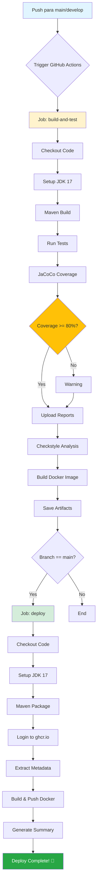

# 📊 Diagrama de CI/CD Pipeline



## 🔄 Fluxo Detalhado

### 1️⃣ **Build and Test Job**

```
┌─────────────────────────────────────┐
│  Trigger: Push/PR to main/develop   │
└──────────────┬──────────────────────┘
               │
               ▼
┌─────────────────────────────────────┐
│  1. Checkout código                 │
│  2. Setup JDK 17                    │
│  3. Maven Cache                     │
└──────────────┬──────────────────────┘
               │
               ▼
┌─────────────────────────────────────┐
│  BUILD PHASE                        │
│  • mvn clean install                │
│  • Compile code                     │
│  • Create JAR                       │
└──────────────┬──────────────────────┘
               │
               ▼
┌─────────────────────────────────────┐
│  TEST PHASE                         │
│  • mvn test (56 tests)              │
│  • Unit tests (JUnit)               │
│  • Integration tests                │
│  • API tests (REST Assured)         │
└──────────────┬──────────────────────┘
               │
               ▼
┌─────────────────────────────────────┐
│  COVERAGE PHASE                     │
│  • Generate JaCoCo report           │
│  • Check minimum 80% coverage       │
│  • Upload artifacts                 │
└──────────────┬──────────────────────┘
               │
               ▼
┌─────────────────────────────────────┐
│  QUALITY PHASE                      │
│  • Checkstyle analysis              │
│  • Code quality checks              │
└──────────────┬──────────────────────┘
               │
               ▼
┌─────────────────────────────────────┐
│  DOCKER BUILD                       │
│  • Build image (only on main)       │
│  • Save artifacts                   │
└──────────────┬──────────────────────┘
               │
               ▼
        ✅ Build Complete
```

### 2️⃣ **Deploy Job** (Only on main branch)

```
┌─────────────────────────────────────┐
│  Condition: main branch + success   │
└──────────────┬──────────────────────┘
               │
               ▼
┌─────────────────────────────────────┐
│  PREPARE PHASE                      │
│  • Checkout code                    │
│  • Setup JDK 17                     │
│  • Maven package                    │
└──────────────┬──────────────────────┘
               │
               ▼
┌─────────────────────────────────────┐
│  AUTHENTICATION                     │
│  • Login to ghcr.io                 │
│  • Use GITHUB_TOKEN                 │
└──────────────┬──────────────────────┘
               │
               ▼
┌─────────────────────────────────────┐
│  METADATA EXTRACTION                │
│  • Generate tags:                   │
│    - latest                         │
│    - main                           │
│    - main-{sha}                     │
└──────────────┬──────────────────────┘
               │
               ▼
┌─────────────────────────────────────┐
│  DOCKER BUILD & PUSH                │
│  • Build image from Dockerfile      │
│  • Tag with metadata                │
│  • Push to ghcr.io                  │
└──────────────┬──────────────────────┘
               │
               ▼
┌─────────────────────────────────────┐
│  SUMMARY GENERATION                 │
│  • Create deployment summary        │
│  • Show image tags                  │
│  • Provide usage instructions       │
└──────────────┬──────────────────────┘
               │
               ▼
        🚀 Deploy Complete!
```

## 📈 Timeline Típico

```
┌──────────────┬─────────────┬──────────────┬──────────────┐
│   0-30s      │   30s-2m    │    2m-3m     │    3m-4m     │
├──────────────┼─────────────┼──────────────┼──────────────┤
│ Setup        │ Build &     │ Quality      │ Deploy       │
│ • Checkout   │ Test        │ Check        │ • Docker     │
│ • JDK        │ • Compile   │ • Coverage   │ • Push       │
│ • Cache      │ • 56 tests  │ • Reports    │ • Summary    │
└──────────────┴─────────────┴──────────────┴──────────────┘
```

**Total**: ~4 minutos (pode variar)

## 🎯 Pontos de Decisão

### 1. Branch Check
```
if branch == "main" AND event == "push":
    → Trigger deploy job
else:
    → Skip deploy, only test
```

### 2. Coverage Check
```
if coverage < 80%:
    → Warning (continue)
    → Flag in report
else:
    → Success ✅
```

### 3. Test Results
```
if any test fails:
    → Stop pipeline ❌
    → No deploy
else:
    → Continue to deploy
```

## 🔐 Permissões Necessárias

```yaml
permissions:
  contents: read      # Ler código do repo
  packages: write     # Escrever no GitHub Packages
  actions: read       # Ler workflows
  checks: write       # Escrever checks de teste
```

## 📦 Artefatos Gerados

| Artefato | Descrição | Retenção | Tamanho |
|----------|-----------|----------|---------|
| `task-manager-jar` | JAR compilado | 7 dias | ~50MB |
| `jacoco-report` | Relatório de cobertura | Permanente | ~5MB |
| Docker Image | Imagem containerizada | Permanente | ~200MB |

## 🌐 Onde os Recursos São Publicados

```
GitHub Repository
├── Actions
│   ├── Workflows (ci-cd.yml)
│   └── Runs (histórico)
├── Packages
│   └── task-manager
│       ├── latest
│       ├── main
│       └── main-{sha}
└── Releases
    └── Artifacts
        ├── JAR files
        └── Coverage reports
```

## 🔍 Monitoramento

### Ver Status em Tempo Real

1. Acesse: `https://github.com/SEU_USUARIO/SEU_REPO/actions`
2. Clique no workflow em execução
3. Veja logs em tempo real

### Badges para README

```markdown


```

## 🚨 Notificações

O GitHub notifica automaticamente:
- ✅ Build com sucesso
- ❌ Build falhou
- ⚠️ Coverage abaixo do esperado

## 📊 Métricas Coletadas

- ✅ Tempo de build
- ✅ Taxa de sucesso
- ✅ Cobertura de testes
- ✅ Número de testes
- ✅ Tamanho da imagem Docker
- ✅ Tempo de deploy

## 🔄 Processo de Rollback

Se algo der errado:

```bash
# 1. Identificar versão anterior
docker images ghcr.io/SEU_USUARIO/task-manager

# 2. Executar versão estável
docker run -p 8080:8080 ghcr.io/SEU_USUARIO/task-manager:main-abc123

# 3. Ou reverter commit
git revert HEAD
git push origin main  # Trigger novo deploy
```

## 📚 Links Úteis

- [GitHub Actions Docs](https://docs.github.com/actions)
- [Docker Build Push Action](https://github.com/docker/build-push-action)
- [JaCoCo Maven Plugin](https://www.jacoco.org/jacoco/trunk/doc/maven.html)
